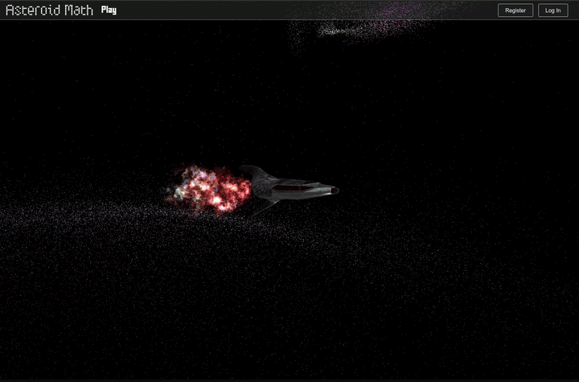

## Description

This is a ThreeJs game that I made as a game assignment that required me to make a game that had the requirement of solving some sort of math problem, this could have been something much simpler but here it remains to have something more to add to my portfolio, also, there are many aspects that could be improved but this was done in a little over a month and I had never worked with ThreeJs before. 

## Quick video demo: 
[](https://www.youtube.com/watch?v=VKnYyXQ9cZs)


## Demo Available

https://fir-auth-97b17.web.app

## Setup

Download [Node.js](https://nodejs.org/en/download/) and Yarn(`npm install --global yarn`).
Run the following commands:

```bash
# Install dependencies (only the first time)
yarn

# Run the local server at localhost:8080
yarn run dev

# Build for production in the dist/ directory
yarn run build
```
